<div align="center" >

# Solution Bandit  [](https://github.com/ClickCyber/Bandit-OverTheWire)


| username | password | difficulty |
| :------------ |:---------------:| -----:|
| bandit0      | bandit0 | easy |
| bandit1      | boJ9jbbUNNfktd78OOpsqOltutMc3MY1        | easy |
| bandit2      | CV1DtqXWVFXTvM2F0k09SHz0YwRINYA9        | easy |
| bandit3      | UmHadQclWmgdLOKQ3YNgjWxGoRMb5luK        | easy |
| bandit4      | pIwrPrtPN36QITSp3EQaw936yaFoFgAB        | easy |
| bandit5      | koReBOKuIDDepwhWk7jZC0RTdopnAYKh        | easy |
| bandit6      | DXjZPULLxYr17uwoI01bNLQbtFemEgo7        | easy |
| bandit7      | HKBPTKQnIay4Fw76bEy8PVxKEDQRKTzs        | easy |
| bandit8      | cvX2JJa4CFALtqS87jk27qwqGhBM9plV        | easy |
| bandit9      | UsvVyFSfZZWbi6wgC7dAFyFuR6jQQUhR        | easy |
| bandit10      | truKLdjsbJ5g7yyJ2X2R0o3a5HQJFuLk        | easy |
| bandit11      | IFukwKGsFW8MOq3IRFqrxE1hxTNEbUPR        | easy |
| bandit12      | 5Te8Y4drgCRfCx8ugdwuEX8KFC6k2EUu        | easy |
| bandit13      | 8ZjyCRiBWFYkneahHwxCv3wb2a1ORpYL        | medium |
| bandit14      | 4wcYUJFw0k0XLShlDzztnTBHiqxU3b3e        | easy |
| bandit15      | BfMYroe26WYalil77FoDi9qh59eK5xNr        | easy |
| bandit16      | cluFn7wTiGryunymYOu4RcffSxQluehd        | easy |
| bandit17      | xLYVMN9WE5zQ5vHacb0sZEVqbrp7nBTn        | easy |
| bandit18      | kfBf3eYk5BPBRzwjqutbbfE887SVc5Yd        | easy |
| bandit19      | IueksS7Ubh8G3DCwVzrTd8rAVOwq3M5x        | easy |
| bandit20      | GbKksEFF4yrVs6il55v6gwY5aVje5f0j        | easy |
| bandit21      | gE269g2h3mw3pwgrj0Ha9Uoqen1c9DGr        | easy |
| bandit22      | Yk7owGAcWjwMVRwrTesJEwB7WVOiILLI        | easy |
| bandit23      | jc1udXuA1tiHqjIsL8yaapX5XIAI6i0n        | easy |
| bandit24      | UoMYTrfrBFHyQXmg6gzctqAwOmw1IohZ        | easy |
| bandit25      | uNG9O58gUE7snukf3bvZ0rxhtnjzSGzG        | medium |
| bandit26     | 5czgV9L3Xx8JPOyRbXh6lQbmIOWvPT6Z        | hard |
| bandit27     | 3ba3118a22e93127a4ed485be72ef5ea        | medium |
| bandit28     | 0ef186ac70e04ea33b4c1853d2526fa2        | easy |
| bandit29     | bbc96594b4e001778eee9975372716b2        | easy |
| bandit30     | 5b90576bedb2cc04c86a9e924ce42faf        | medium |
| bandit31     | 47e603bb428404d265f59c42920d81e5        | easy |
| bandit32     | 56a9bf19c63d650ce78e6ec0354ee45e        | medium |
| bandit33     | c9c3199ddf4121b10cf581a98d51caee        | easy |

</div>

#

<div align="center">

## Bandit Level 0
<text style="font-family: 'Lucida Console', 'Courier New', monospace;">

The password for the next level is stored in a file called <b>readme</b> located in the home directory. Use this password to log into bandit1 using SSH. Whenever you find a password for a level, use SSH (on port 2220) to log into that level and continue the game.
</text>
#
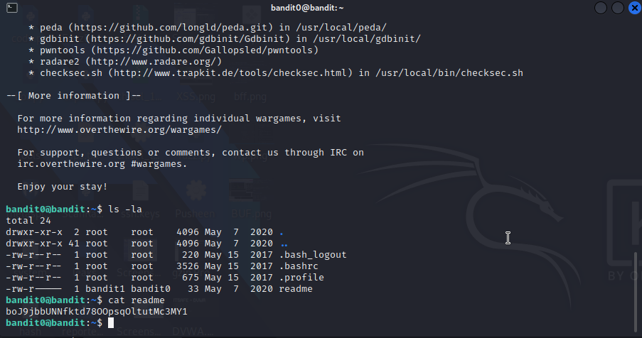
</div>

#

<div align="center">

## Bandit Level 0 → Level 1
<text style="font-family: 'Lucida Console', 'Courier New', monospace;">

The password for the next level is stored in a file called <b>-</b> located in the home directory
</text>

#
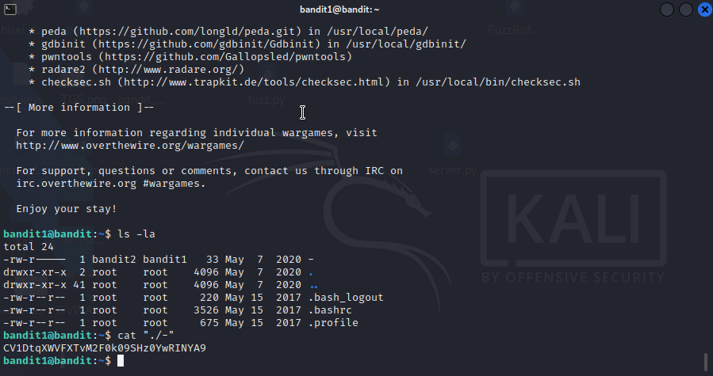
</div>

#
<div align="center">

## Bandit Level 1 → Level 2
<text style="font-family: 'Lucida Console', 'Courier New', monospace;">

The password for the next level is stored in a file called <b>spaces in this filename</b> located in the home directory
</text>

#
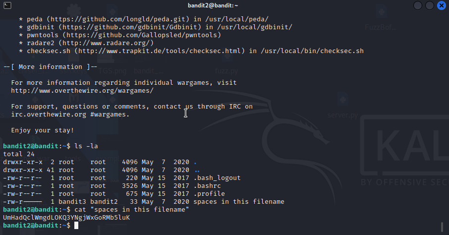

</div>

#
<div align="center">

## Bandit Level 2 → Level 3
<text style="font-family: 'Lucida Console', 'Courier New', monospace;">

The password for the next level is stored in a hidden file in the <b>inhere</b> directory.
</text>

#
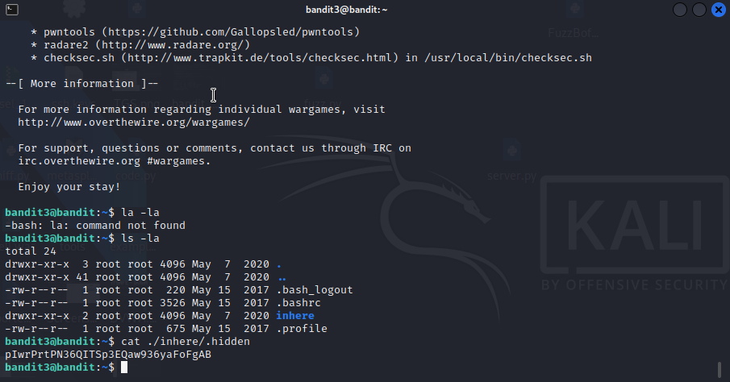
</div>

#
<div align="center">

## Bandit Level 3 → Level 4
<text style="font-family: 'Lucida Console', 'Courier New', monospace;">

The password for the next level is stored in the only human-readable file in the <b>inhere</b> directory. Tip: if your terminal is messed up, try the “reset” command.
</text>

#
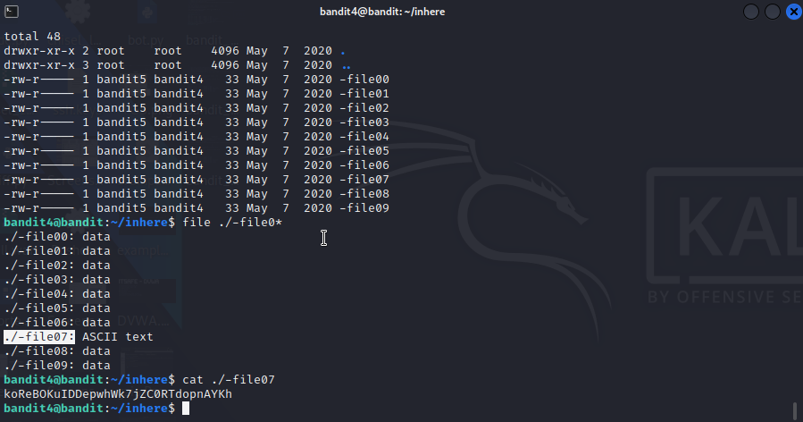
</div>

#

<div align="center">

## Bandit Level 4 → Level 5
<text style="font-family: 'Lucida Console', 'Courier New', monospace;">

The password for the next level is stored in a file somewhere under the <b>inhere</b> directory and has all of the following properties: human-readable 1033 bytes in size not executable
</text>

#
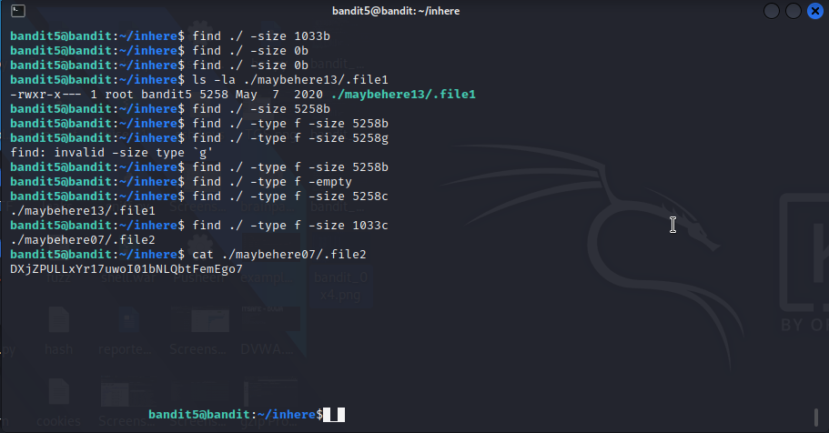
</div>

#
<div align="center">

## Bandit Level 5 → Level 6
<text style="font-family: 'Lucida Console', 'Courier New', monospace;">
The password for the next level is stored <b>somewhere on the server</b> and has all of the following properties: owned by user bandit7 owned by group bandit6 33 bytes in size
</text>

#
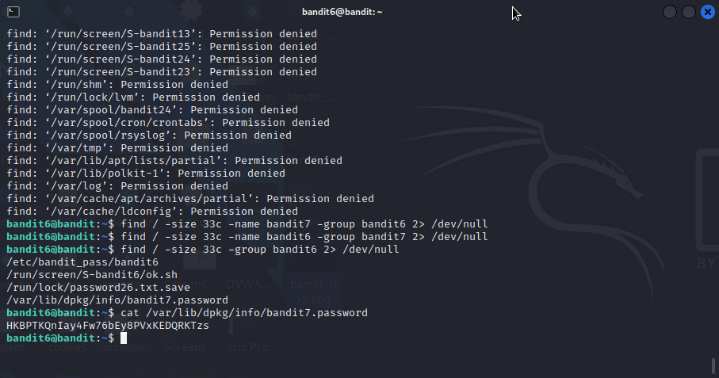
</div>

#
<div align="center">

## Bandit Level 7 → Level 8
<text style="font-family: 'Lucida Console', 'Courier New', monospace;">

The password for the next level is stored in the file <b>data.txt</b> next to the word <b>millionth</b>
</text>

#
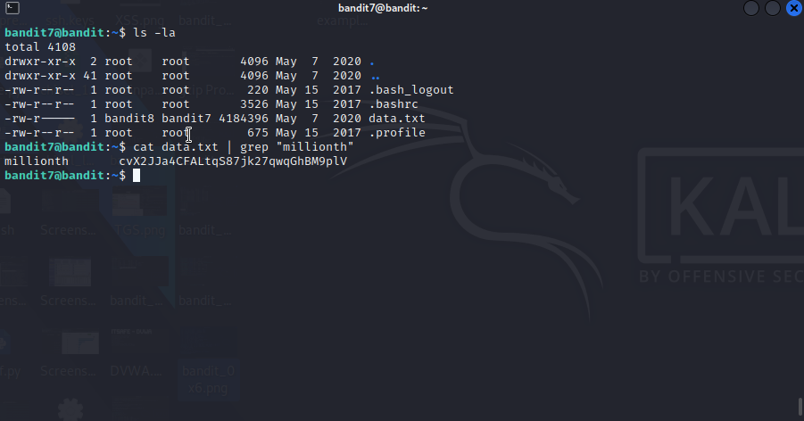
</div>

#
<div align="center">

## Bandit Level 8 → Level 9
<text style="font-family: 'Lucida Console', 'Courier New', monospace;">
The password for the next level is stored in the file <b>data.txt</b> and is the only line of text that occurs only once 
</text>

#
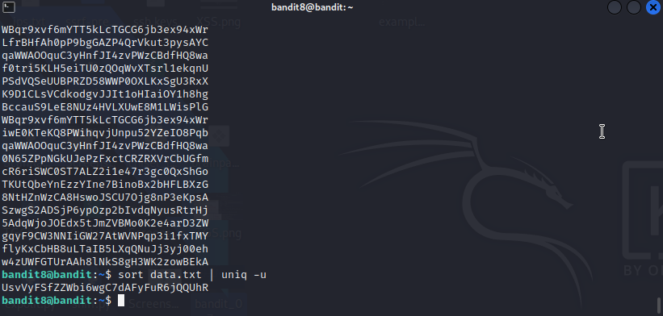
</div>


#
<div align="center">

## Bandit Level 9 → Level 10
<text style="font-family: 'Lucida Console', 'Courier New', monospace;">
The password for the next level is stored in the file <b>data.txt</b> in one of the few human-readable strings, preceded by several ‘=’ characters. 
</text>

#
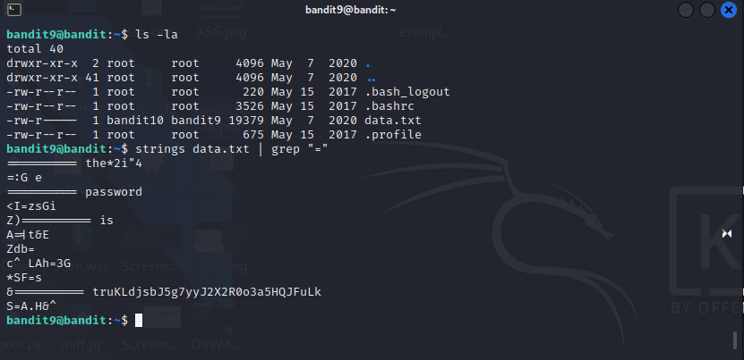
</div>

#
<div align="center">

## Bandit Level 10 → Level 11
<text style="font-family: 'Lucida Console', 'Courier New', monospace;">
The password for the next level is stored in the file <b>data.txt,</b> which contains base64 encoded data.
</text>

#
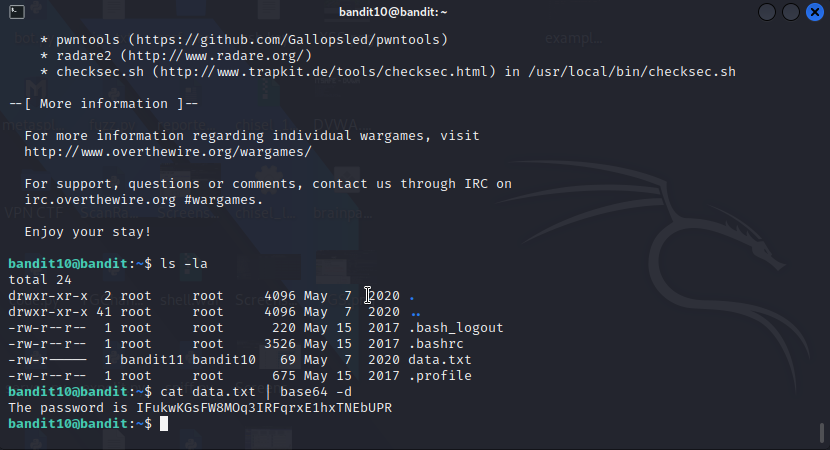
</div>

#
<div align="center">

## Bandit Level 11 → Level 12
<text style="font-family: 'Lucida Console', 'Courier New', monospace;">
The password for the next level is stored in the file <b>data.txt,</b> where all lowercase (a-z) and uppercase (A-Z) letters have been rotated by 13 positions
</text>

#
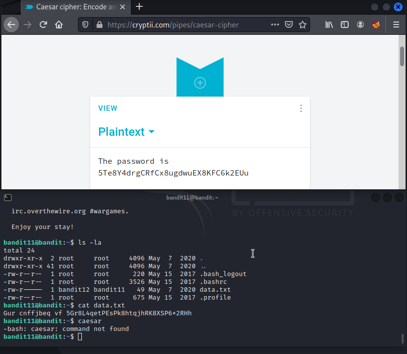
</div>

#
<div align="center">

## Bandit Level 12 → Level 13
<text style="font-family: 'Lucida Console', 'Courier New', monospace;">
The password for the next level is stored in the file data.txt, which is a hexdump of a file that has been repeatedly compressed. For this level it may be useful to create a directory under /tmp in which you can work using mkdir. For example: mkdir /tmp/myname123. Then copy the datafile using cp, and rename it using mv (read the manpages!)
</text>

#
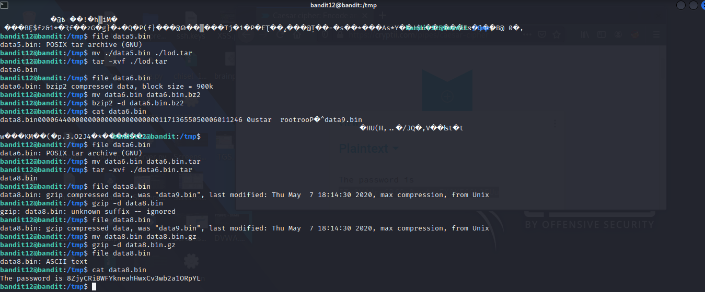
</div>

#
<div align="center">

## Bandit Level 13 → Level 14
<text style="font-family: 'Lucida Console', 'Courier New', monospace;">
The password for the next level is stored in <b>/etc/bandit_pass/bandit14 and can only be read by user bandit14.</b> For this level, you don’t get the next password, but you get a private SSH key that can be used to log into the next level. <b>Note: localhost</b> is a hostname that refers to the machine you are working on
</text>

#
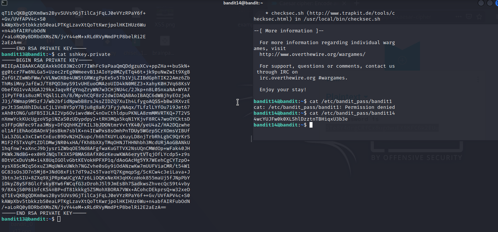
</div>

#
<div align="center">

## Bandit Level 14 → Level 15
<text style="font-family: 'Lucida Console', 'Courier New', monospace;">
The password for the next level can be retrieved by submitting the password of the current level to <b>port 30000 on localhost.</b>
</text>

#

</div>

#
<div align="center">

## Bandit Level 15 → Level 16
<text style="font-family: 'Lucida Console', 'Courier New', monospace;">
The password for the next level can be retrieved by submitting the password of the current level to <b>port 30001 on localhost</b> using SSL encryption.

<b>Helpful note: Getting “HEARTBEATING” and “Read R BLOCK”? Use -ign_eof and read the “CONNECTED COMMANDS” section in the manpage. Next to ‘R’ and ‘Q’, the ‘B’ command also works in this version of that command…</b>
</text>

#
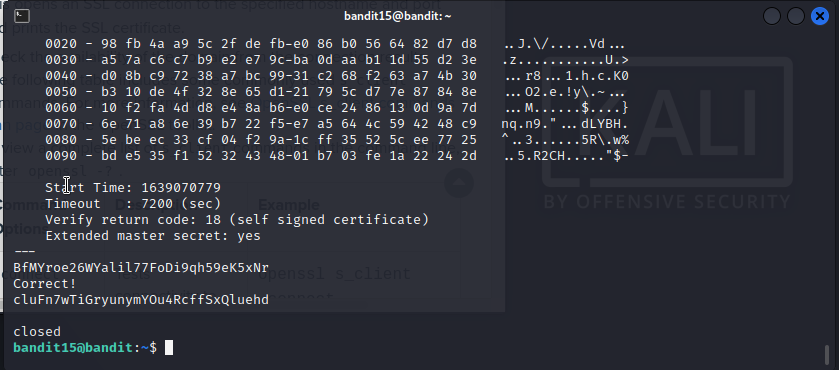
</div>

#
<div align="center">

## Bandit Level 16 → Level 17
<text style="font-family: 'Lucida Console', 'Courier New', monospace;">
The credentials for the next level can be retrieved by submitting the password of the current level to <b>a port on localhost in the range 31000 to 32000.</b> First find out which of these ports have a server listening on them. Then find out which of those speak SSL and which don’t. There is only 1 server that will give the next credentials, the others will simply send back to you whatever you send to it.
</text>

#
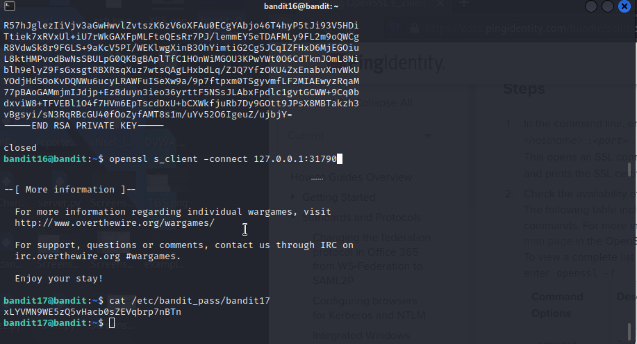
</div>

#
<div align="center">

## Bandit Level 17 → Level 18
<text style="font-family: 'Lucida Console', 'Courier New', monospace;">
There are 2 files in the homedirectory: <b>passwords.old and passwords.new.</b> The password for the next level is in <b>passwords.new</b> and is the only line that has been changed between <b>passwords.old and passwords.new</b>

<b>NOTE: if you have solved this level and see ‘Byebye!’ when trying to log into bandit18, this is related to the next level, bandit19</b>
</text>

#
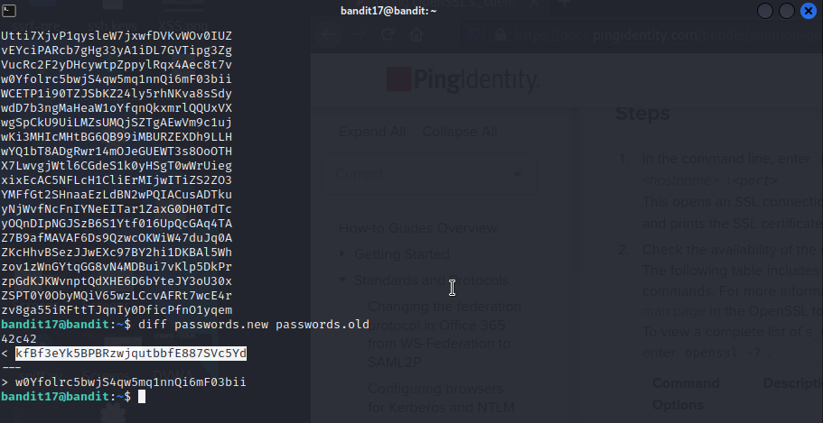
</div>

#
<div align="center">

## Bandit Level 18 → Level 19
<text style="font-family: 'Lucida Console', 'Courier New', monospace;">
The password for the next level is stored in a file <b>readme</b> in the homedirectory. Unfortunately, someone has modified <b>.bashrc</b> to log you out when you log in with SSH
</text>

#
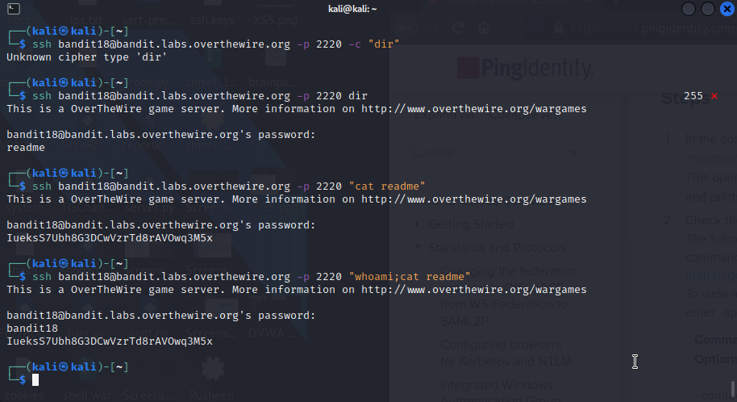
</div>

#
<div align="center">

## Bandit Level 19 → Level 20
<text style="font-family: 'Lucida Console', 'Courier New', monospace;">
To gain access to the next level, you should use the setuid binary in the homedirectory. Execute it without arguments to find out how to use it. The password for this level can be found in the usual place (/etc/bandit_pass), after you have used the setuid binary.
</text>

#
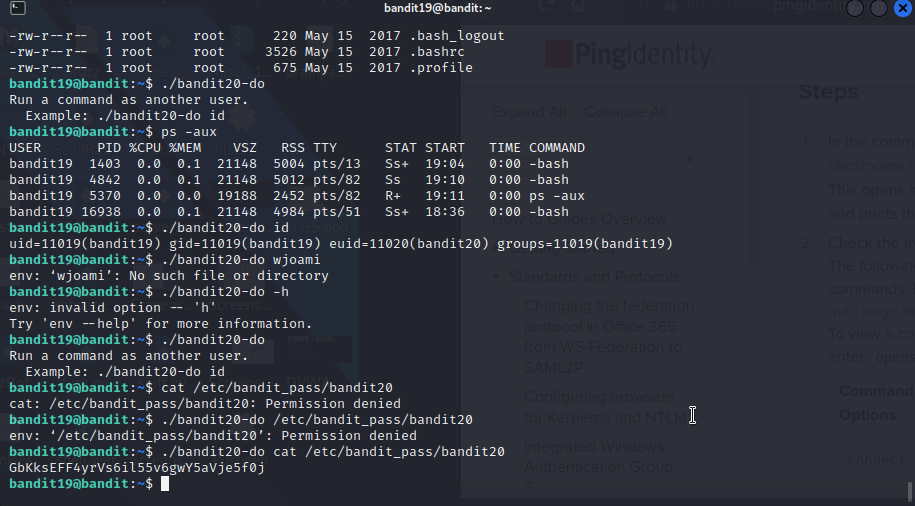
</div>

#
<div align="center">

## Bandit Level 20 → Level 21
<text style="font-family: 'Lucida Console', 'Courier New', monospace;">
There is a setuid binary in the homedirectory that does the following: it makes a connection to localhost on the port you specify as a commandline argument. It then reads a line of text from the connection and compares it to the password in the previous level (bandit20). If the password is correct, it will transmit the password for the next level (bandit21).

<b>NOTE:</b> Try connecting to your own network daemon to see if it works as you think
</text>

#
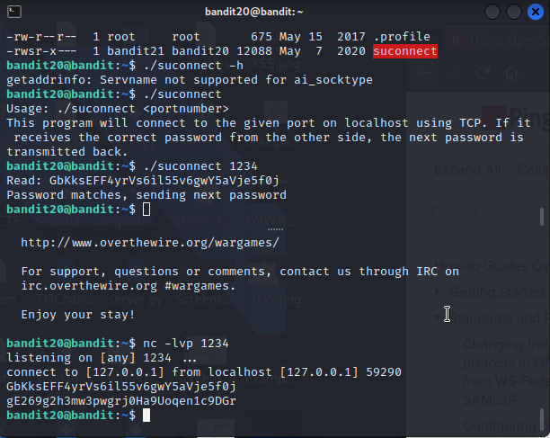
</div>

#
<div align="center">

## Bandit Level 21 → Level 22
<text style="font-family: 'Lucida Console', 'Courier New', monospace;">
A program is running automatically at regular intervals from <b>cron,</b> the time-based job scheduler. Look in <b>/etc/cron.d/</b> for the configuration and see what command is being executed.
</text>

#
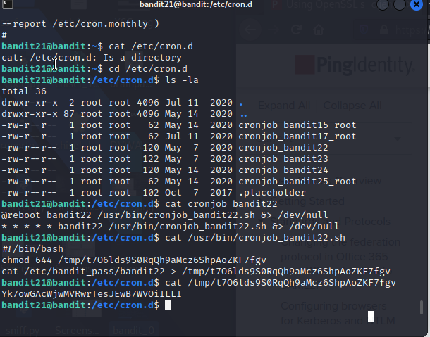
</div>

#
<div align="center">

## Bandit Level 22 → Level 23
<text style="font-family: 'Lucida Console', 'Courier New', monospace;">
A program is running automatically at regular intervals from <b>cron,</b> the time-based job scheduler. Look in <b>/etc/cron.d/</b> for the configuration and see what command is being executed.

<b>NOTE:</b> Looking at shell scripts written by other people is a very useful skill. The script for this level is intentionally made easy to read. If you are having problems understanding what it does, try executing it to see the debug information it prints.
</text>

#
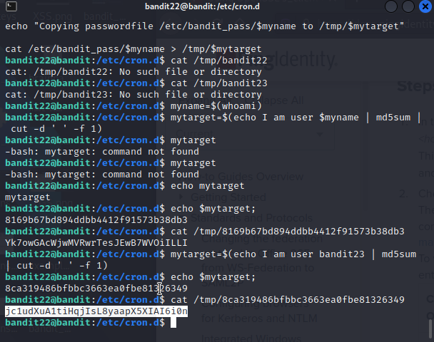
</div>

#
<div align="center">

## Bandit Level 23 → Level 24
<text style="font-family: 'Lucida Console', 'Courier New', monospace;">
A program is running automatically at regular intervals from <b>cron,</b> the time-based job scheduler. Look in <b>/etc/cron.d/</b> for the configuration and see what command is being executed.

<b>NOTE:</b> This level requires you to create your own first shell-script. This is a very big step and you should be proud of yourself when you beat this level!

<b>NOTE 2:</b> Keep in mind that your shell script is removed once executed, so you may want to keep a copy around…
</text>

#
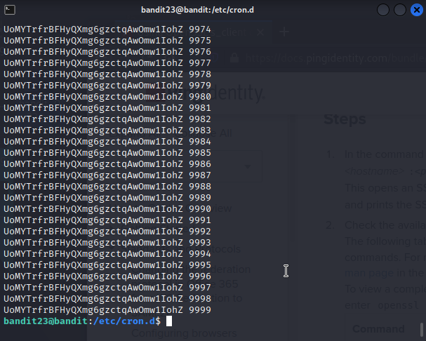
</div>


#
<div align="center">

## Bandit Level 24 → Level 25
<text style="font-family: 'Lucida Console', 'Courier New', monospace;">
A daemon is listening on port 30002 and will give you the password for bandit25 if given the password for bandit24 and a secret numeric 4-digit pincode. There is no way to retrieve the pincode except by going through all of the 10000 combinations, called brute-forcing.
</text>

#
</div>

```python
import socket
code = 999
PASSWORD_STAGE_24 = "UoMYTrfrBFHyQXmg6gzctqAwOmw1IohZ"
PORT = 30002
IP = '127.0.0.1'
def send_packet(sock, payload):
    sock.send(payload)
    response = sock.recv(2048).decode()
    if not response == 'Wrong! Please enter the correct pincode. Try again.\n':
        print(response, payload)

def PIN_HACKED():
    global code
    try:
        with socket.socket(socket.AF_INET, socket.SOCK_STREAM) as sock:
            sock.connect((IP, PORT))
            print(sock.recv(2048).decode())
            while True:
                print('[+] pin code send {0} ...'.format(code), end='\r')
                payload = '{0} {1} {2}'.format(PASSWORD_STAGE_24, code, '\n').encode()
                send_packet(sock, payload)
                code += 1
    except Exception as error:
        print(error)

PIN_HACKED()
```
#
<div align="center">
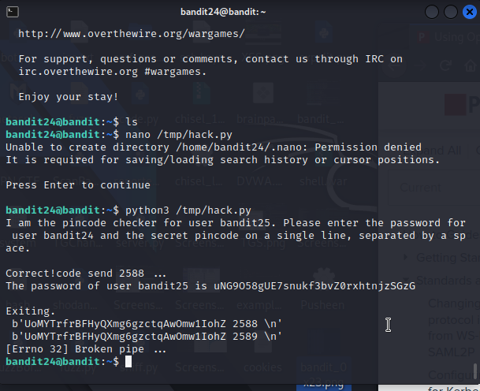
</div>

#

<div align="center">

## Bandit Level 25 → Level 26
<text style="font-family: 'Lucida Console', 'Courier New', monospace;">
Logging in to bandit26 from bandit25 should be fairly easy… The shell for user bandit26 is not <b>/bin/bash,</b> but something else. Find out what it is, how it works and how to break out of it.
</text>

#
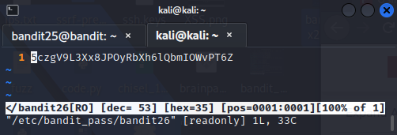
</div>

#

<div align="center">

## Bandit Level 26 → Level 27
<text style="font-family: 'Lucida Console', 'Courier New', monospace;">
Good job getting a shell! Now hurry and grab the password for bandit27!
</text>

#
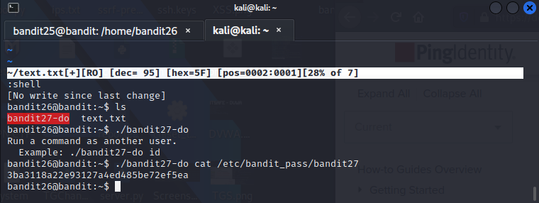
</div>

#

<div align="center">

## Bandit Level 27 → Level 28
<text style="font-family: 'Lucida Console', 'Courier New', monospace;">
There is a git repository at ssh://bandit<b>27</b>-git@localhost/home/bandit<b>27</b>-git/repo. The password for the user bandit<b>27</b>-git is the same as for the user bandit<b>27</b>.

Clone the repository and find the password for the next level.
</text>

#
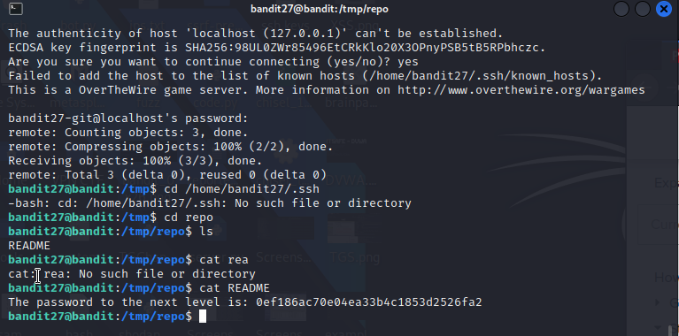
</div>


#

<div align="center">

## Bandit Level 28 → Level 29
<text style="font-family: 'Lucida Console', 'Courier New', monospace;">
There is a git repository at ssh://bandit<b>28</b>-git@localhost/home/bandit<b>28</b>-git/repo. The password for the user bandit<b>28</b>-git is the same as for the user bandit<b>28.</b>

Clone the repository and find the password for the next level.
</text>

#
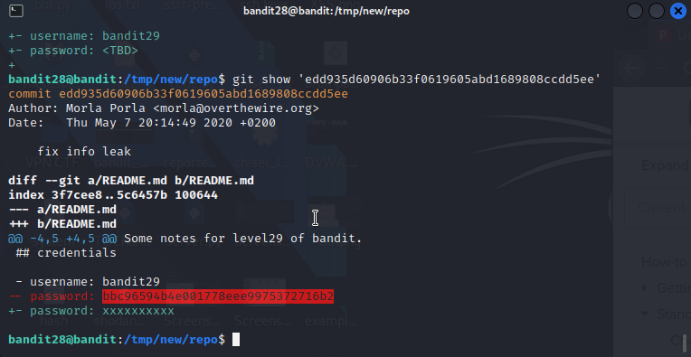
</div>

#

<div align="center">

## Bandit Level 29 → Level 30
<text style="font-family: 'Lucida Console', 'Courier New', monospace;">
There is a git repository at ssh://bandit<b>29</b>-git@localhost/home/bandit<b>29</b>-git/repo. The password for the user bandit<b>29</b>-git is the same as for the user bandit<b>29</b>.

Clone the repository and find the password for the next level.
</text>

#
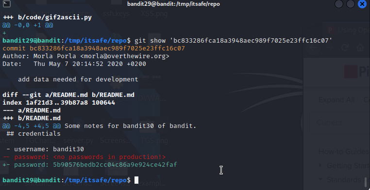
</div>

#

<div align="center">

## Bandit Level 30 → Level 31
<text style="font-family: 'Lucida Console', 'Courier New', monospace;">
There is a git repository at ssh://bandit<b>30</b>-git@localhost/home/bandit<b>30</b>-git/repo. The password for the user bandit<b>30</b>-git is the same as for the user bandit<b>30</b>.

Clone the repository and find the password for the next level.
</text>

#

</div>


#

<div align="center">

## Bandit Level 31 → Level 32
<text style="font-family: 'Lucida Console', 'Courier New', monospace;">
There is a git repository at ssh://bandit<b>31</b>-git@localhost/home/bandit<b>31</b>-git/repo. The password for the user bandit<b>31</b>-git is the same as for the user bandit<b>31</b>.

Clone the repository and find the password for the next level.
</text>

#

</div>

#

<div align="center">

## Bandit Level 32 → Level 33
<text style="font-family: 'Lucida Console', 'Courier New', monospace;">
After all this git stuff its time for another escape. Good luck!
</text>

#
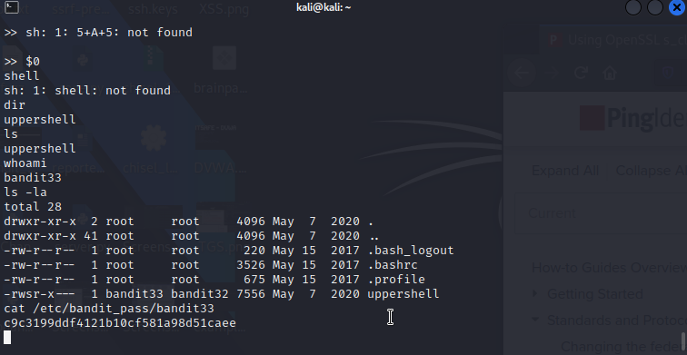
</div>


#

<div align="center">

## Bandit Level 33 → Level 34
<text style="font-family: 'Lucida Console', 'Courier New', monospace;">
<b>
At this moment, level 34 does not exist yet.</b>
</text>

#
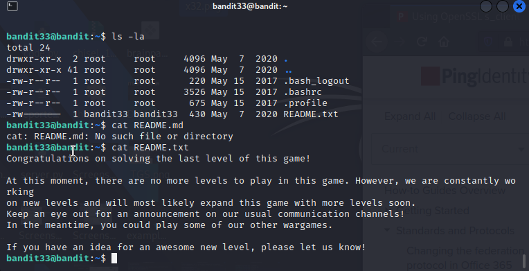
</div>

